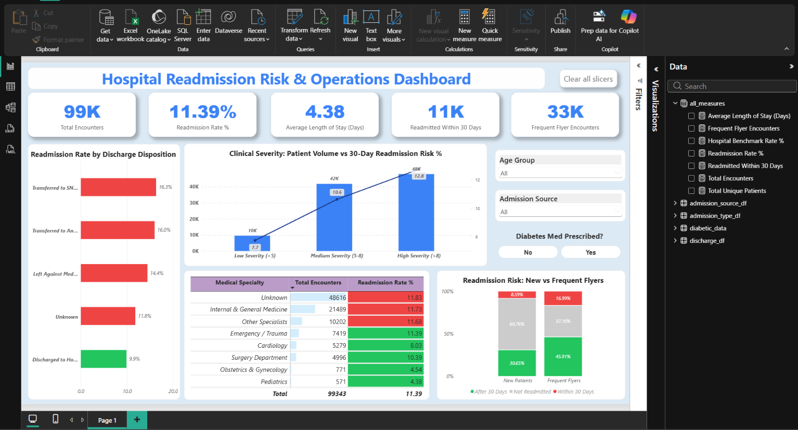
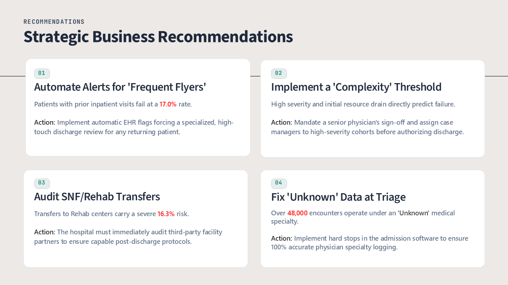

<br>
<br>

# 🏥 Hospital Readmission Risk & Clinical Operations: 30-Day Penalty Audit (99K+ Encounters)

> **End-to-end clinical data analytics pipeline auditing 99,343 inpatient encounters across 69,990 unique patients to isolate systemic drivers of 30-day readmissions, eliminate survivorship bias, model operational risk via advanced SQLite, and deliver an interactive Power BI risk-monitoring platform.**

<br>

🔗 **[Run the Complete Code Live on Kaggle (No Setup Required)](https://www.kaggle.com/code/sauravsingh184/diabetic-risk-analytics-sql-eda)**  
🔗 **[View Interactive Power BI Dashboard](dashboard/clinical_operation.pbix)**  
🔗 **[View Standalone SQL Analytics Pipeline](sql/SQL_Queries.sql)**  
🔗 **[View Executive Business Presentation (.pptx)](presentation/Executive_Report.pptx)**

---

<br>

## 📌 Table of Contents
1. **[Executive Summary & Clinical Problem Statement](#1-executive-summary--clinical-problem-statement)**
2. **[Tech Stack & Analytics Architecture](#2-tech-stack--analytics-architecture)**
3. **[Data Engineering & Survivorship Bias Mitigation](#3-data-engineering--survivorship-bias-mitigation)**
4. **[Relational SQL Modeling (CTEs, Feature Engineering & Risk Bins)](#4-relational-sql-modeling-ctes-feature-engineering--risk-bins)**
5. **[Key Analytical Findings (Clinical Failure & Risk Vectors)](#5-key-analytical-findings-clinical-failure--risk-vectors)**
6. **[Interactive Power BI Operations Dashboard](#6-interactive-power-bi-operations-dashboard)**
7. **[Strategic Executive Recommendations (HRRP Risk Mitigation)](#7-strategic-executive-recommendations-hrrp-risk-mitigation)**
8. **[Project File Structure & Reproducibility Guide](#8-project-file-structure--reproducibility-guide)**
9. **[Author & Contact](#9-author--contact)**

---

<br>

## 1. Executive Summary & Clinical Problem Statement

**The Problem:** The hospital faces substantial financial penalties and operational strain driven by elevated 30-day readmission rates among diabetic patients. High-risk patient profiles, departmental performance gaps, and unoptimized discharge policies are currently pushing readmissions beyond acceptable limits.

**The Objective:** Move beyond basic exploratory data analysis to pinpoint the exact demographic, operational, and clinical drivers of clinical failure. The primary goal is to isolate actionable interventions that can bring readmission rates safely below the **11.39% hospital baseline**.

**The Solution:** An end-to-end analytics pipeline that engineered raw diagnostic codes into clinical severity buckets, deployed advanced SQL models to map readmission risk, and culminated in a C-suite ready Power BI dashboard and Executive Presentation.

---

<br>

## 2. Tech Stack & Analytics Architecture

| Category | Core Tool | Application in Project |
| :--- | :--- | :--- |
| **Data Engineering** | **Python (Pandas)** | Survivorship bias mitigation, null imputation, ICD-9 dimensional mapping |
| **Data Modeling** | **Advanced SQL (SQLite)** | `CTEs` (WITH clauses), `CASE WHEN` aggregations, Multi-table `INNER JOIN` logic |
| **EDA Visuals** | **Matplotlib / Seaborn** | Dual-axis volume vs. risk charts to eliminate visual fatigue |
| **Business BI** | **Microsoft Power BI** | Executive KPI tracking, dynamic risk slicers, global operational dashboarding |
| **Reporting** | **Executive Presentation** | Translating technical metrics into C-suite strategic ROI recommendations |


---

<br>

## 3. Data Engineering & Survivorship Bias Mitigation

Raw healthcare data is highly granular and prone to statistical bias. Before executing any analytical models, the dataset underwent strict cleansing to ensure business accuracy:

*   **Survivorship Bias Mitigation:** Explicitly removed expired and hospice-bound patient encounters. Including deceased patients would have artificially lowered the readmission rate, creating a flawed business baseline.
*   **Clinical Categorization:** Engineered a Python mapping function to convert hundreds of raw, sparse ICD-9 diagnostic codes into 8 readable clinical disease categories.
*   **Dimension Consolidation:** Grouped 79 scattered medical specialties down to 8 core hospital departments, and standardized missing values to explicit `'Unknown'` labels.

```python
# Feature Engineering Snippet: Mitigating Survivorship Bias & Standardizing Data
expired_ids = [11, 13, 14, 19, 20, 21]

# 1. Drop deceased/hospice patients to prevent skewed readmission baselines
diabetic_clean = diabetic_data[~diabetic_data['discharge_disposition_id'].isin(expired_ids)]

# 2. Standardize missing values for accurate SQL grouping later
diabetic_clean['medical_specialty'] = diabetic_clean['medical_specialty'].replace('?', 'Unknown')
```

---

<br>

## 4. Relational SQL Modeling (CTEs, Feature Engineering & Risk Bins)

Instead of relying entirely on Pandas for aggregation, the core risk metrics were modeled directly using advanced relational SQLite queries to ensure scalability:

*   **Dynamic Feature Engineering:** Built custom clinical segments on the fly (e.g., classifying patients as 'New' vs. 'Frequent Flyers' based on prior inpatient visits).
*   **Multi-Table Joins:** Executed relational `INNER JOIN` queries to seamlessly integrate clean dimension tables with the primary patient fact table.
*   **Noise Reduction:** Applied strict encounter volume thresholds (`HAVING COUNT > 500`) to ensure readmission rates were not artificially spiked by low-volume statistical anomalies.

```sql
/* SQL Snippet: Engineering the 'Frequent Flyer' Risk Multiplier via CTE */
WITH PatientRisk AS (
    SELECT 
        patient_nbr,
        CASE 
            WHEN number_inpatient > 0 THEN 'Frequent Flyer' 
            ELSE 'New Patient' 
        END AS patient_type,
        COUNT(encounter_id) AS total_visits,
        SUM(CASE WHEN readmitted = '<30' THEN 1 ELSE 0 END) AS failed_discharges
    FROM diabetic_data
    GROUP BY patient_nbr
)
SELECT 
    patient_type,
    SUM(total_visits) AS cohort_volume,
    ROUND((CAST(SUM(failed_discharges) AS FLOAT) / SUM(total_visits)) * 100, 2) AS readmission_rate_pct
FROM PatientRisk
GROUP BY patient_type;
```

---

<br>

## 5. Key Analytical Findings (Clinical Failure & Risk Vectors)

By querying the cleaned dataset against the **11.39% hospital baseline**, the SQL models isolated five primary vectors driving readmission penalties. The findings are summarized in the risk matrix below:

| Risk Vector | High-Risk Cohort | Encounter Volume | Readmission Rate | Strategic Insight |
| :--- | :--- | :--- | :--- | :--- |
| **Utilization History** | Frequent Flyers (>0 prior visits) | 33,000+ | **17.00%** | Risk virtually doubles compared to 'New Patients' (8.59%). |
| **Triage Data Quality** | 'Unknown' Medical Specialty | 48,616 | **11.83%** | Masks departmental accountability and exposes a critical software flaw. |
| **Clinical Complexity** | High Severity (>8 Diagnoses) | ~48k | **12.77%** | Predicts heavy initial resource drain (Avg. 44.2 labs & 16.9 meds). |
| **Post-Acute Care** | SNF & Rehab Transfers | ~18k | **16.30%** | Indicates severe failure in third-party post-discharge care protocols. |
| **Age Demographics** | Young Adults (20-30 Age Group) | ~2k | **14.30%** | Highest relative failure risk, despite lower absolute patient volume. |

> **Bottom Line:** The bulk of the hospital's financial penalty is not driven by random clinical failures, but by predictable operational gaps—specifically returning patients (Frequent Flyers) and unmonitored transfers to third-party Rehab facilities.

----

<br>

## 6. Interactive Power BI Operations Dashboard

To provide hospital administrators with a dynamic, real-time risk-monitoring tool, the SQL-processed dataset was ingested into Microsoft Power BI to build an interactive executive dashboard.

> 

### Key Dashboard Features:
*   **Macro-Level KPI Scorecard:** Delivers instant visibility into the **99K** total encounters, the **11.39%** readmission baseline, average length of stay (**4.38 days**), and the critical **33K** frequent flyer volume.
*   **Dynamic Global Slicers:** Allows executives to filter the entire hospital portfolio on the fly by *Age Group*, *Admission Source*, and *Diabetes Medication* prescriptions.
*   **Targeted Risk Visuals:** Features a dual-axis line/bar chart mapping clinical severity against readmission risk and a proportional bar chart emphasizing the 'Frequent Flyer' danger zone.

---

<br>

## 7. Strategic Executive Recommendations (HRRP Risk Mitigation)

Based on the multi-dimensional clinical risk analysis, the following strategic roadmap was developed for the hospital board to actively reduce readmission penalties:

1.  🚨 **Automate Alerts for 'Frequent Flyers':** 
    *   ***The Risk:*** Patients with prior inpatient visits fail at a severe **17.0%** rate.
    *   ***The Action:*** Implement automatic EHR (Electronic Health Record) flags forcing a specialized, high-touch discharge review for any returning patient.
2.  🩺 **Implement a 'Complexity' Threshold:** 
    *   ***The Risk:*** High severity and initial resource drain directly predict failure. 
    *   ***The Action:*** Mandate a senior physician's sign-off and assign case managers to high-severity cohorts (>8 diagnoses) before authorizing discharge.
3.  🏢 **Audit SNF/Rehab Transfers:** 
    *   ***The Risk:*** Transfers to Rehab and SNF centers carry a severe **16.3%** risk. 
    *   ***The Action:*** The hospital must immediately audit third-party facility partners to ensure capable post-discharge care protocols are being followed.
4.  💻 **Fix 'Unknown' Data at Triage:** 
    *   ***The Risk:*** Over **48,000** encounters operate under an 'Unknown' medical specialty, completely masking departmental accountability. 
    *   ***The Action:*** Implement hard stops in the admission software to ensure 100% accurate physician specialty logging.


> 

---

<br>

## 8. Project File Structure & Reproducibility Guide

To ensure complete transparency and reproducibility, this project is organized as follows:

```text
├── data/
│   ├── raw_diabetic_data.csv               # Original uncleaned dataset (100K+ rows)
│   └── ID_mapping.csv                      # Dimension mapping for admission/discharge IDs
├── notebooks/
│   └── readmission_risk_audit.ipynb        # Complete Python & SQLite execution code
├── dashboard/
│   └── clinical_operations.pbix            # Interactive Power BI Dashboard file
├── images/
│   └── dashboard.png                       # dashboard screenshot
│   └── recommendation_slide                # recommendations screenshot
├── presentation/
│   └── Executive_Report.pdf                # C-Suite business presentation deck
├── sql/
│   └── SQL_Queries                         # only sql queries
└── README.md                               # Project documentation
```

**How to Run This Project:**
1. **Live Execution:** The easiest way to interact with the code is via the Kaggle link provided at the top of this document. No local environment setup is required.
2. **Local Execution:** 
   * Clone this repository.
   * Ensure Python 3.8+ and standard libraries (`pandas`, `sqlite3`, `matplotlib`, `seaborn`) are installed.
   * Run the Jupyter Notebook sequentially. The SQLite database will be generated in-memory during runtime.

---

<br>

## 9. Author & Contact

**Saurav Singh**  
*Data Analyst*

Passionate about leveraging advanced SQL, Python, and BI tools to transform complex, messy datasets into actionable business strategies and operational improvements.

* **Email:** [sauravgusain184@gmail.com](mailto:sauravgusain184@gmail.com)
* **GitHub:** [@saurav-18s](https://github.com/saurav-18s)
* **LinkedIn:** [@saurav-singh-1844s](https://www.linkedin.com/in/saurav-singh-1844s)
* **Kaggle:** [@sauravsingh184](https://www.kaggle.com/sauravsingh184)